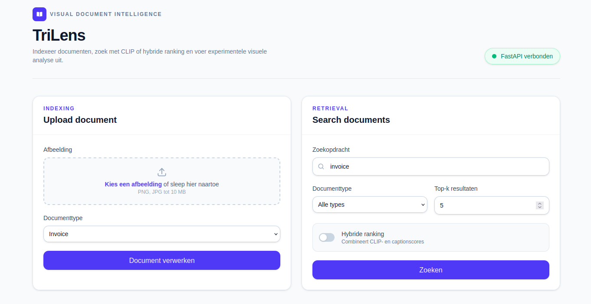
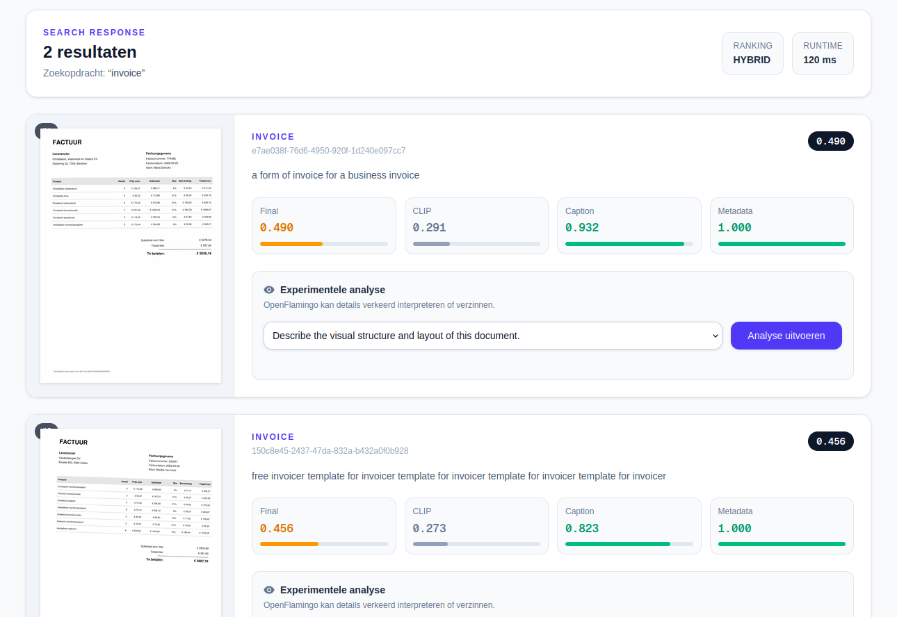
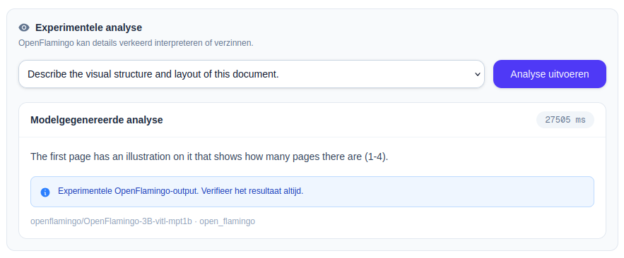
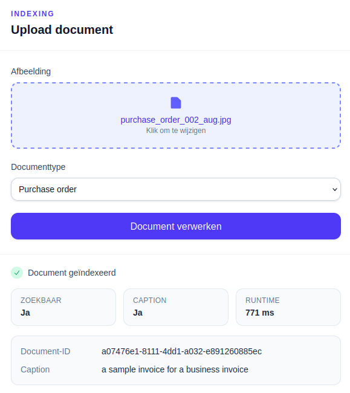

# TriLens Document Intelligence

TriLens is a local multimodal document intelligence application for visual document indexing, semantic retrieval, automatic captioning and experimental document analysis.

The application combines:

- **CLIP** for image-text retrieval;
- **BLIP** for automatic document captions;
- **OpenFlamingo** for optional query-driven document analysis;
- **FastAPI** as the backend API;
- **Next.js** as the primary user interface;
- **Streamlit** as the original prototype interface;
- **SQLite and NumPy** for local metadata and embedding storage.

> TriLens is a portfolio and learning project. Model output may be inaccurate and must not be used as legal, financial or identity advice.

---

## Demo

The primary interface consists of a single dashboard:

1. upload a document image;
2. let CLIP and BLIP process the document;
3. search documents with natural language;
4. compare CLIP and hybrid ranking scores;
5. run experimental analysis directly on a search result.

### Unified dashboard

The primary Next.js interface combines document upload and semantic search in a single dashboard.



### Semantic document retrieval

Search results include the document image, BLIP caption and individual ranking signals for CLIP, caption similarity and metadata similarity.



### Inline document analysis

A selected result can be analysed directly without navigating to a separate page. OpenFlamingo is optional, and TriLens can expose a BLIP caption fallback when analysis is unavailable.



### Document indexing

Uploaded images are validated, preprocessed, embedded with CLIP and captioned with BLIP.



---

## Problem statement

Document search engines often rely on file names, manually entered metadata or OCR text.

TriLens explores a different approach: searching documents based on their visual and semantic characteristics.

Example queries:

```text
invoice with several product rows
store receipt
form with multiple input fields
document containing a signature
identity document
```

This allows documents to be retrieved even when the exact words from the query do not literally appear in the document.

---

## Architecture

```text
Next.js dashboard
        │
        │ HTTP
        ▼
FastAPI API
        │
        ▼
DocumentIntelligencePipeline
        │
        ├── preprocessing
        │     ├── image validation
        │     ├── EXIF correction
        │     ├── RGB conversion
        │     └── resizing
        │
        ├── CLIP retrieval
        │     ├── image embeddings
        │     ├── text embeddings
        │     └── cosine similarity
        │
        ├── BLIP captioning
        │
        ├── hybrid reranking
        │
        └── optional OpenFlamingo analysis
              └── BLIP caption fallback
        │
        ▼
SQLite metadata + NumPy embeddings
```

The application uses a shared application pipeline. FastAPI and Streamlit are thin adapters around the same services and domain logic.

---

## CLIP, BLIP and OpenFlamingo

### CLIP

CLIP converts images and text into vectors in a shared embedding space.

TriLens uses CLIP for:

- indexing document images;
- encoding search queries;
- computing cosine similarity;
- ranking top-k documents.

CLIP is not an OCR system. It is primarily suited for visual and semantic similarity.

### BLIP

BLIP generates a short description of a document image.

The caption is:

- stored as a model artifact;
- displayed in search results;
- used as an additional signal in hybrid ranking;
- used as a fallback when OpenFlamingo cannot provide analysis.

### OpenFlamingo

OpenFlamingo is used experimentally to answer a question about a single selected document.

OpenFlamingo:

- is disabled by default;
- is lazily loaded;
- can be very slow on CPU;
- requires a large amount of memory;
- may misinterpret or hallucinate visual details.

On systems with approximately 8 GB of GPU memory, the current configuration may not fit entirely in GPU memory.

---

## Features

### Document indexing

- PNG, JPG and JPEG files;
- file and image validation;
- SHA-256 checksum;
- detection of previously indexed documents;
- preprocessing;
- CLIP image embedding;
- BLIP caption;
- partial recovery when one model step fails;
- local storage of metadata and artifacts.

### Search

- natural language queries;
- top-k ranking;
- filtering by document type;
- CLIP baseline;
- optional hybrid ranking;
- individual scores for:
  - CLIP;
  - caption similarity;
  - metadata similarity;
  - final ranking.

### Analysis

- query-driven analysis of a single document;
- optional OpenFlamingo execution;
- BLIP caption fallback;
- model name, source and runtime in the response;
- warning for unreliable model output.

---

## Project structure

```text
trilens-document-intelligence/
├── app/
│   ├── api/
│   │   ├── routes/
│   │   ├── dependencies.py
│   │   └── main.py
│   ├── domain/
│   ├── preprocessing/
│   ├── repositories/
│   ├── services/
│   ├── strategies/
│   ├── ui/
│   └── bootstrap.py
├── frontend/
│   ├── src/
│   │   ├── app/
│   │   └── lib/
│   ├── package.json
│   └── package-lock.json
├── tests/
├── data/
├── docs/
├── streamlit_app.py
├── pyproject.toml
└── README.md
```

Runtime files, uploads, databases, embeddings and model caches do not belong in Git.

---

## Requirements

Recommended local environment:

- Python 3.12;
- Node.js 20 or newer;
- npm;
- sufficient free disk space for model files;
- optionally a CUDA-compatible GPU.

OpenFlamingo requires several gigabytes of model files and is not required for upload, captioning or retrieval.

---

## Installation

Clone the repository:

```bash
git clone https://github.com/Johan-torfs/trilens-document-intelligence.git
cd trilens-document-intelligence
```

Create a Python virtual environment:

```bash
python -m venv .venv
source .venv/bin/activate
```

Install the Python dependencies using the project installation method:

```bash
pip install -e .
```

If the project does not yet have an installable dependency configuration in `pyproject.toml`, use the provided requirements file:

```bash
pip install -r requirements.txt
```

Install the frontend:

```bash
cd frontend
npm ci
cd ..
```

---

## Configuration

Copy the backend configuration:

```bash
cp .env.example .env
```

Copy the frontend configuration:

```bash
cp frontend/.env.example frontend/.env.local
```

### Backend variables

```env
TRILENS_OPEN_FLAMINGO_ENABLED=false
TRILENS_OPEN_FLAMINGO_DEVICE=cpu
TRILENS_CORS_ORIGINS=http://localhost:3000
```

### Frontend variables

```env
NEXT_PUBLIC_API_URL=http://127.0.0.1:8000
```

OpenFlamingo remains disabled for the default MVP:

```env
TRILENS_OPEN_FLAMINGO_ENABLED=false
```

Enable experimental CPU analysis:

```env
TRILENS_OPEN_FLAMINGO_ENABLED=true
TRILENS_OPEN_FLAMINGO_DEVICE=cpu
```

---

## Running the application

### FastAPI

Start from the project root:

```bash
source .venv/bin/activate
uvicorn app.api.main:app --reload
```

The API is available at:

```text
http://127.0.0.1:8000
```

Interactive API documentation:

```text
http://127.0.0.1:8000/docs
```

Health check:

```text
GET http://127.0.0.1:8000/api/health
```

### Next.js

Start in a second terminal:

```bash
cd frontend
npm run dev
```

Open:

```text
http://localhost:3000
```

### Streamlit prototype

The original prototype interface remains available:

```bash
streamlit run streamlit_app.py
```

The Next.js interface is the primary portfolio frontend.

---

## API endpoints

| Method | Endpoint                                | Description                    |
| ------ | --------------------------------------- | ------------------------------ |
| `GET`  | `/api/health`                           | Checks the API status          |
| `POST` | `/api/documents`                        | Uploads and indexes a document |
| `POST` | `/api/search`                           | Searches documents             |
| `GET`  | `/api/documents/{document_id}/image`    | Returns the document image     |
| `POST` | `/api/documents/{document_id}/analysis` | Analyses a selected document   |

---

## Example: search

Request:

```json
{
  "query": "invoice with several product rows",
  "top_k": 5,
  "document_type": "invoice",
  "use_hybrid_ranking": true
}
```

Simplified response:

```json
{
  "ranking_mode": "hybrid",
  "results": [
    {
      "document_id": "example-document-id",
      "rank": 1,
      "final_score": 0.84,
      "clip_score": 0.79,
      "caption_score": 0.96,
      "metadata_score": 1.0,
      "caption": "an invoice containing multiple product rows",
      "image_url": "/api/documents/example-document-id/image",
      "document_type": "invoice"
    }
  ]
}
```

---

## Dataset

The current demonstration dataset contains synthetic, public and derived document images.

Document categories include:

- invoices;
- purchase orders;
- receipts;
- delivery notes;
- application forms;
- fictitious identity cards.

The dataset is small and intended for architecture and functionality demonstration. It does not constitute a representative production benchmark.

Do not use real identity documents, customer documents or documents containing personal data.

---

## Tests

Run all Python tests:

```bash
python -m pytest
```

Run the frontend checks:

```bash
cd frontend
npm run lint
npm run build
```

The test suite includes tests for:

- image validation;
- preprocessing;
- checksums;
- repositories;
- cosine similarity;
- ranking;
- CLIP service integration;
- BLIP captioning;
- OpenFlamingo fallback;
- application pipeline;
- FastAPI endpoints.

Model-dependent tests use mocks where possible. CI should not download large model checkpoints.

---

## Privacy

TriLens is designed as a local portfolio and research project.

Important limitations:

- use only synthetic, public or properly anonymised data;
- do not commit personal data;
- do not commit real identity documents;
- uploads are processed locally;
- the application does not automatically upload documents to an external service;
- logging should not contain image content or sensitive document text;
- model output may be incorrect or hallucinated;
- results are not legal, financial or identity advice.

Always check the licence terms of external datasets before publishing or redistributing images.

---

## Known limitations

- The dataset is small.
- There is no formal retrieval benchmark yet.
- CLIP does not read exact document text like an OCR engine.
- Retrieval quality varies by document category and query phrasing.
- BLIP captions are general and sometimes miss small document details.
- OpenFlamingo can hallucinate or generate repetitive output.
- OpenFlamingo is slow on CPU.
- The current OpenFlamingo configuration may exceed a GPU with 8 GB of memory.
- There is no authentication or user management.
- There is no rate limiting.
- Processing is synchronous.
- Only document images are supported.
- The system is not intended for production use.

---

## Evaluation

A formal retrieval benchmark is not yet part of the first MVP.

A future evaluation will use a fixed dataset and at least ten manually labelled queries, including:

- Recall@1;
- Recall@3;
- average query time;
- average indexing time;
- qualitative error analysis.

The current dataset is primarily intended to demonstrate the end-to-end architecture.

---

## Roadmap

### Next quality phase

- research additional safe document datasets;
- evaluate retrieval quality;
- compare and update models;
- improve latency and memory usage;
- research OpenFlamingo prompts and checkpoints;
- refine CLIP and caption reranking.

### Possible later extensions

- automatic document classification;
- OCR and hybrid text-image retrieval;
- support for PDF and Office documents;
- multi-page documents;
- asynchronous indexing;
- batch uploads;
- Docker and persistent model cache volumes;
- extended observability;
- production authentication and rate limiting.

---

## Technical decisions

### Why local storage?

SQLite and NumPy keep the MVP:

- simple;
- inspectable;
- local;
- reproducible;
- free of external infrastructure.

### Why an application pipeline?

`DocumentIntelligencePipeline` orchestrates the specialised services without duplicating model, storage or UI logic.

This allows FastAPI and Streamlit to use the same core functionality.

### Why two frontends?

Streamlit was used to quickly validate the ML flow.

A separate FastAPI and Next.js architecture was then added to demonstrate a more realistic application design.

---

## Status

**MVP 1**

Working:

- document upload;
- preprocessing;
- CLIP indexing;
- BLIP captioning;
- semantic retrieval;
- hybrid ranking;
- optional OpenFlamingo analysis;
- caption fallback;
- local storage;
- FastAPI;
- Next.js dashboard;
- Streamlit prototype;
- automated tests.

Planned after MVP 1:

- formal evaluation;
- additional datasets;
- model quality improvement;
- performance optimisation;
- automatic classification;
- support for other document formats;
- OCR engine integration for content-based document analysis.

---

## Licence

The original source code and project documentation of TriLens Document Intelligence are made available under the MIT License.

See [LICENSE](LICENSE) for the full licence text.

This licence does not automatically apply to:

- external model weights;
- external datasets;
- images from external datasets;
- software dependencies;
- third-party code or assets.

CLIP, BLIP and OpenFlamingo models and their checkpoints retain their own licence terms. The same applies to Hugging Face datasets and other public data sources.

Users and contributors are responsible for checking the applicable model, dataset and dependency licences before redistributing, publishing or commercially using any files.
